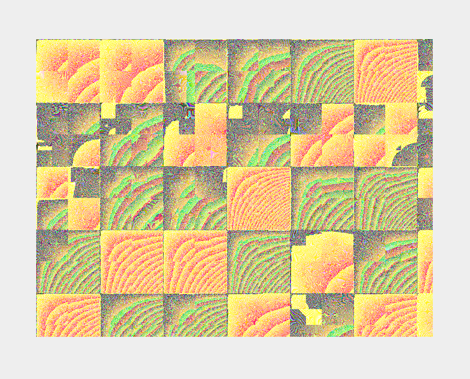
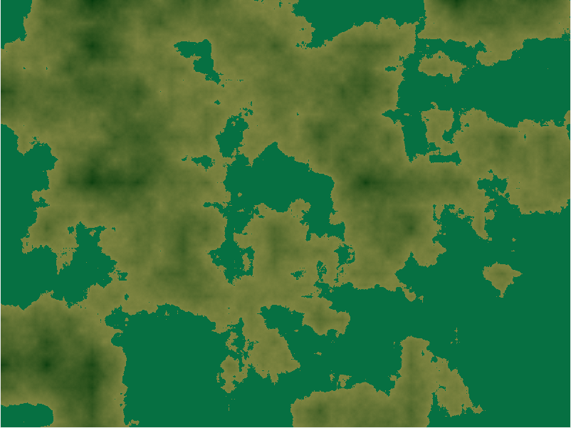
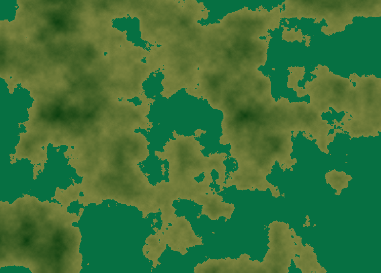
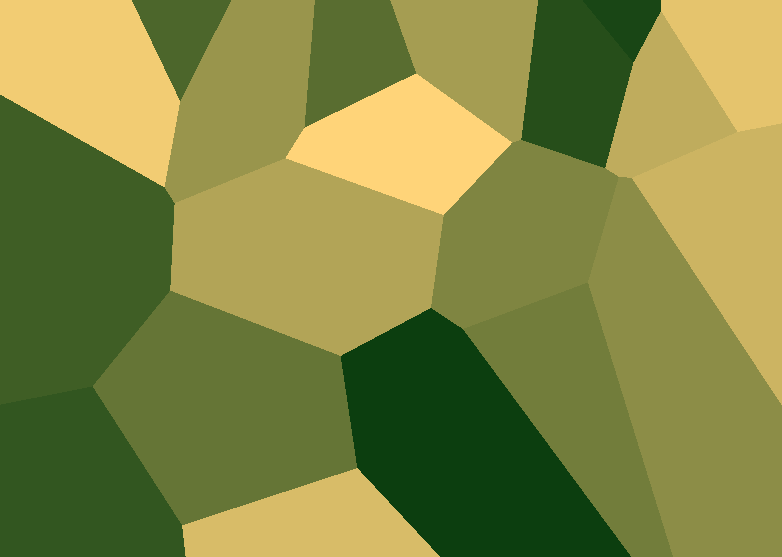

# GENERATOR
## Možné implementace

- výšková mapa
- teplotní mapa
- Vítr plus fronty
- Déšt + řeky terénem?
- Tvrdost různých povrchů


## Progress Log
### V 0.1 
- změna persistance na 0.7 (větší náhodnodnost), odstranenim *sampleFreq. z blendů dojde k zajímavým rozbitím (zjistit důvod)
Zatím umí jenom Heightmapu



### V 0.1.1 
- Persistance změněna zpět na 0.55, základní přidání mořské hladiny, hodnoty pod 0.5 jsou nyní voda V perlinově šumu nová interpolace místo lineární cosinová Výšková mapa tímto hotová
- Linearní interpolace - nevýhoda hrany<br>
```
  static float Interpolate(float x0, float x1, float alpha){
    return x0 * (1 - alpha) + alpha * x1;    
  }
```


- cosinova interpolace - vypadá lépe<br>
  ```
    static float Interpolate(float x0, float x1, float alpha){
      double cosine = (1.0 - Math.cos(alpha * Math.PI)) / 2.0;
      return (float) (x0 * (1 - cosine) + cosine * x1);
    }
  ```


### V 0.1.2
- trochu jsem si pohral s perlin noisem aby leva a prava strana na sebe navazovali, chce to dovylepsit
- nově Voronoiho Diagram(spatne nazev mam nejspis) rozdeleni bodu do blizkych okruhu idealní pro tektonicke desky<br>
